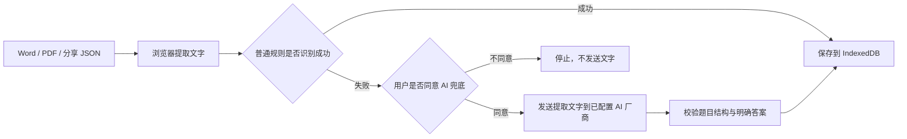
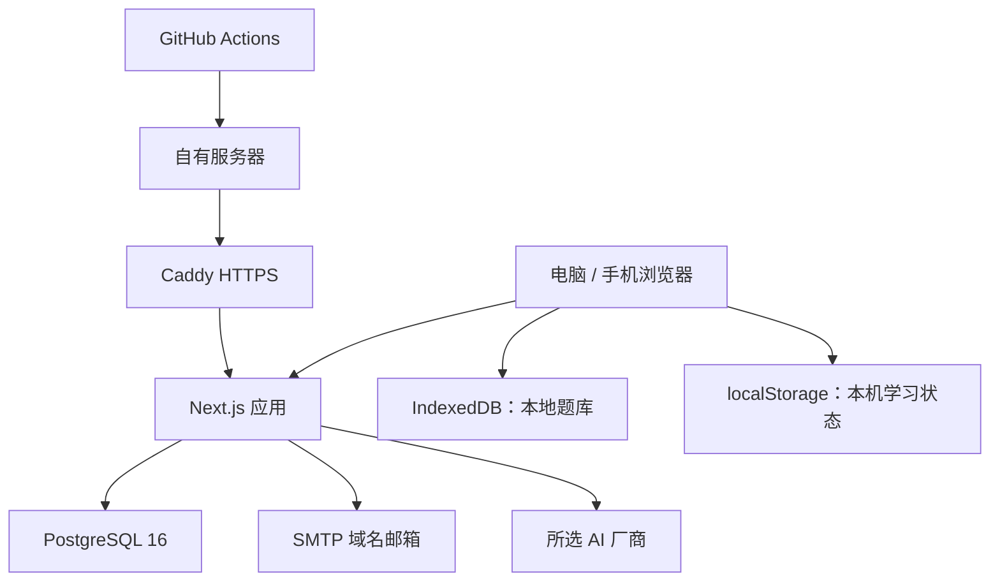

# AveCove Elapse · 红豆生南国

<p align="center">
  
</p>

<p align="center">
  一款现代、无广告、可自行部署的题库训练、复盘与 AI 辅学工作台。
</p>

<p align="center">
  <a href="README.md">English</a> ·
  <a href="docs/部署与上线指南.md">部署指南</a> ·
  <a href="docs/上线检查清单.md">上线检查清单</a> ·
  <a href="SECURITY.md">安全说明</a> ·
  <a href="COPYRIGHT.md">版权说明</a>
</p>

<p align="center">
  
  
  
  
  
</p>

<p align="center">
  
</p>

## 项目简介

AveCove Elapse 是“红豆生南国”刷题网页的独立、可自行部署版本，目前首先面向医学学习场景。

它可以把个人 Word、PDF 等学习资料整理成可持续使用的题库书架，并提供单选与多选练习、错题复盘、收藏、笔记、可选 AI 解析、轻量多端学习状态同步和带审核机制的讨论区。

项目不依赖广告变现，不要求手机号或微信登录。学号只用于生成不可逆的同步标识，原始学号不会写入数据库；邮箱仅在用户主动绑定时用于验证码登录和评论身份保护。

> 当前版本线：`0.3.x` 预览版。项目只内置 8 道演示题，不包含完整儿科学课程题库或其他受版权保护的商业题库。

## 为什么做这个项目

- **题库属于使用者。** 可以导入自己的 Word、PDF、扫描 PDF 或 `.hongdou.json` 分享题库。
- **本地优先。** 原始题库文件默认在浏览器内解析，不上传到应用服务器。
- **真正的题库书架。** 每次导入都会保留，可切换、重命名、全局搜索、分享、删除和单独重置学习记录。
- **AI 边界透明。** AI 不是强制功能；普通识别失败时，只有得到用户明确同意，才会把已提取文字发送给所配置的 AI 厂商。
- **适合医学学习。** AI 内容与公开讨论均明确标注为学习辅助，不替代教材、指南、执业判断或临床诊疗。
- **适合自己部署。** 已准备 PostgreSQL、Docker Compose、Caddy HTTPS、健康检查、备份恢复脚本和 GitHub Actions。
- **不绑定单一 AI 厂商。** 同时支持国内外厂商及自定义兼容接口。
- **身份信息更克制。** 不要求手机号，也不依赖微信等社交平台账户。

## 功能总览

### 我的题库

- 一次选择或拖入多个文件，逐个导入。
- 支持 Word、文字型 PDF、扫描 PDF 浏览器 OCR，以及红豆题库分享文件。
- 每个文件分别显示等待、处理中、成功、待 AI、失败和超时状态。
- 成功导入后自动保存在浏览器 IndexedDB 中。
- 在多份题库之间切换，不清除其他题库的学习记录。
- 支持题库重命名和删除。
- 跨全部本地题库搜索题干、选项、分类和题库名称。
- 分享前显示版权与隐私确认，可导出便携的 `.hongdou.json` 文件。
- 支持单独重置某一题库的已答记录、错题状态、收藏和笔记；重置前显示影响数量与不可撤销提示，题库本身不会删除。

### 刷题与复盘

- 根据答案数据自动识别单选题与多选题。
- 可选择“仅做单选”或“单选＋多选”。
- 顺序练习与随机挑战。
- 可选选项随机，减少位置记忆。
- 可选“答对自动下一题”；答错时停留在当前题目进行复盘。
- 支持未练题目、错题和收藏题目范围。
- 答题卡、题号跳转、当前题库搜索、收藏和个人笔记。
- 本机保存学习进度，并支持学习记录 JSON 导出与导入。
- 支持浅色和夜间模式。

### AI 辅助学习

- **大神总结：** 提炼核心判断，解释正确答案与关键鉴别点。
- **易错提示：** 定位陷阱词、相似干扰项和常见错误原因。
- **知微：** 保留上下文继续追问，用更通俗的方式解释。
- 普通规则无法识别时，可选择 AI 识别 `1-A`、`1.A`、章节末尾答案表等非标准答案格式。
- AI 兜底被明确要求只使用文件中已经给出的答案，不自行猜测缺失答案。
- 支持每日请求额度和厂商费用控制。
- API Key 始终留在服务器端，可使用 AES-256-GCM 加密后保存到 PostgreSQL。

目前内置厂商预设：

| 区域 | 厂商 |
| --- | --- |
| 国内 | DeepSeek、通义千问、Kimi、豆包、智谱 GLM |
| 海外 | OpenAI、Google Gemini、Anthropic Claude |
| 自定义 | OpenAI 兼容私有网关或其他第三方接口 |

由于厂商模型和接口可能调整，基础地址与模型名称均可修改，正式使用时应以厂商控制台最新文档为准。

### 身份、同步与讨论区

- 学号经过 HMAC 转换为不可逆同步标识，原始学号不进入 PostgreSQL。
- 可选邮箱验证码，用于登录恢复与评论身份保护。
- 不使用手机号或微信登录。
- 学习进度、收藏、笔记、设置和昵称具备云端同步能力。
- 支持学习记录 JSON 导出和重新导入。
- 共享评论支持点赞、举报、本人删除、敏感词预审、禁言和管理员审核台。
- 用户注销后删除相关云端学习状态、评论、点赞和举报，本机题库与本机数据仍可保留。

题库内容保持本地优先，原始 Word/PDF 不参与多端同步。其他设备仍需单独导入对应题库，云端只保存用户选择同步的学习状态。

## 导入流程与隐私边界



AI 兜底不会发送原始文档，只发送浏览器已经提取的文字，并且必须先获得用户确认。使用前应确认文件中不含患者资料、个人隐私或其他敏感信息。AI 识别仍可能出错，导入后应抽查题目与答案。

## 技术架构



| 层级 | 技术 | 作用 |
| --- | --- | --- |
| Web 应用 | Next.js 16、React 19、TypeScript | 界面、刷题流程和 API 路由 |
| 本机数据 | IndexedDB、localStorage | 导入题库与本机优先的学习记录 |
| 服务端数据 | PostgreSQL 16 | 匿名身份、同步状态、评论、审核、AI 配置与用量 |
| 文档识别 | Mammoth、PDF.js、Tesseract.js | Word 提取、PDF 文字提取和浏览器 OCR |
| 邮件 | Nodemailer 与自选 SMTP 服务商 | 登录验证码 |
| 公网入口 | Caddy | HTTPS 证书与反向代理 |
| 运维 | Docker Compose、脚本、GitHub Actions | 部署、健康检查、备份、恢复与自动更新 |

## 项目目录

```text
app/
├── api/                 登录、同步、评论、AI、健康检查等服务端接口
├── admin/               评论审核与 AI 管理页面
├── custom-ai/           用户可见的 AI 厂商配置页
├── lib/                 文件导入、题目解析、本地题库、身份与厂商逻辑
├── page.tsx             主产品页面
└── questions.json       8 道演示题
db/init.sql              PostgreSQL 数据库结构
docs/                    部署、上线检查与隐私文档
scripts/                 迁移、备份、恢复和服务器维护脚本
.github/workflows/       持续集成与服务器部署流程
Dockerfile               生产应用镜像
docker-compose.yml       应用、PostgreSQL 与 Caddy
Caddyfile                 HTTPS 反向代理配置
```

## 环境要求

### 本地开发

- Node.js `>= 22.13`
- npm
- PostgreSQL 16：同步、邮箱验证码、评论与服务端 AI 配置需要数据库

即使外部 AI、SMTP 或同步服务尚未配置，本地题库和基础刷题功能仍可使用。

### 公网部署

- 推荐 Ubuntu 22.04 或 24.04
- 建议至少 2 核 CPU、4 GB 内存、20 GB 磁盘
- Docker Engine 与 Docker Compose v2
- 已解析到服务器的域名
- 公网开放 80、443；PostgreSQL 不开放公网端口

## 快速开始

```bash
git clone <你的仓库地址>
cd AveCove-Elapse
cp .env.example .env
npm install
docker compose up -d postgres
npm run dev
```

访问 `http://localhost:3000`。

- 自定义 AI：`http://localhost:3000/custom-ai`
- 评论审核：`http://localhost:3000/admin`
- 健康检查：`http://localhost:3000/api/health`

本地开发环境未配置 SMTP 时，会返回调试验证码而不真正发送邮件；生产环境不能依赖该行为。

## 环境变量

将 `.env.example` 复制为 `.env`。不要将 `.env`、SMTP 密码、AI Key、部署 SSH 私钥或数据库备份提交到 Git。

### 必需的服务端密钥

每个字段应使用独立随机值，不要重复使用同一个密钥：

```bash
openssl rand -base64 36
```

| 变量 | 用途 |
| --- | --- |
| `POSTGRES_PASSWORD` | PostgreSQL 应用密码 |
| `SYNC_SECRET` | 生成不可逆同步标识的 HMAC 密钥 |
| `CONFIG_ENCRYPTION_KEY` | 加密保存的 AI API Key |
| `ADMIN_KEY` | 保护评论审核和 AI 管理入口 |
| `DOMAIN` | Caddy 使用的公网域名 |
| `NEXT_PUBLIC_SITE_URL` | 完整公网 HTTPS 地址 |

### 域名邮箱 SMTP

SMTP 只配置在服务器 `.env`，不放在网页中：

```dotenv
SMTP_HOST=smtp.你的邮件服务商域名
SMTP_PORT=465
SMTP_SECURE=true
SMTP_USER=no-reply@你的域名
SMTP_PASS=SMTP密码或应用专用密码
SMTP_FROM=红豆生南国 <no-reply@你的域名>
```

- 端口 `465` 通常设置 `SMTP_SECURE=true`。
- 端口 `587` 使用 STARTTLS 时通常设置 `SMTP_SECURE=false`。
- `SMTP_PASS` 应使用邮件服务商提供的 SMTP 密码或应用专用密码，不一定等于网页登录密码。
- 修改后重建应用容器，发送真实验证码，并检查垃圾邮件 / Spam 文件夹。

### AI 配置

推荐从 `/custom-ai` 页面配置。API Key 经加密后保存到 `app_settings`；`.env` 中的 `OPENAI_API_KEY` 与 `OPENAI_MODEL` 仅作为可选 OpenAI 兜底。

通过 `AI_DAILY_LIMIT` 控制每个匿名访客或同步身份的每日请求量，并建议在 AI 厂商控制台设置预算与费用告警。

## Docker 与 Caddy 公网部署

1. 将域名 A/AAAA 记录指向服务器。
2. 将项目克隆到 `/opt/avecove-elapse` 等独立目录。
3. 从 `.env.example` 创建 `.env`，替换所有示例值。
4. PostgreSQL 仅在 Docker 内网使用，公网只按需开放 SSH、HTTP 和 HTTPS。
5. 启动：

```bash
docker compose up -d --build
docker compose ps
```

6. 访问 `https://你的域名/api/health` 检查服务状态。
7. 对照[上线检查清单](docs/上线检查清单.md)验收后再邀请用户。

DNS 与防火墙正确时，Caddy 会自动申请和续期 HTTPS 证书。

完整部署、备份和回滚流程见 [docs/部署与上线指南.md](docs/部署与上线指南.md)。

## GitHub Actions 自动部署

项目包含：

- `.github/workflows/ci.yml`：自动构建与测试。
- `.github/workflows/deploy.yml`：`main` 更新后部署到自有服务器。

启用部署前，在 GitHub 仓库中配置：

| Secret | 说明 |
| --- | --- |
| `DEPLOY_SSH_KEY` | 仅用于部署的独立 SSH 私钥 |
| `SERVER_HOST` | 服务器 IP 或域名 |
| `SERVER_USER` | 权限受限的部署用户 |
| `SERVER_PATH` | 部署目录，例如 `/opt/avecove-elapse` |

服务器 `.env` 和备份目录应留在服务器上，源代码部署不得覆盖它们。

## 数据库、备份与恢复

需要时执行数据库迁移：

```bash
npm run db:migrate
```

手动备份 PostgreSQL：

```bash
./scripts/backup.sh
```

恢复应在受控维护窗口执行：

```bash
./scripts/restore.sh /备份文件的绝对路径/avecove-elapse-日期.sql.gz
```

安装定期备份与日志维护：

```bash
sudo ./scripts/install-server-maintenance.sh /opt/avecove-elapse
```

只生成备份文件并不代表安全，应定期实际验证能否恢复。

## 构建与测试

```bash
npm run lint
npm test
```

`npm test` 会执行生产构建，并检查演示题库、核心交互、多题库存储、批量导入、AI 兜底、评论审核、安全文案和部署材料。

## 安全与隐私

- 不要导入患者姓名、住院号、联系方式、影像原片或其他临床隐私。
- 不要把密钥写进前端代码、Git 历史、截图、Issue 或聊天消息。
- 会话 Cookie 使用 `HttpOnly`、`SameSite=Lax`，生产环境仅通过 HTTPS 发送。
- 邮箱验证码 10 分钟过期，并有频率限制。
- 评论具备频率限制、敏感词预审、举报、隐藏、禁言和管理员操作记录。
- PostgreSQL 只允许应用内网访问，不应开放公网 5432 端口。
- 报告安全问题时，不要附带真实学号、邮箱、密钥或受版权保护的题库文件。

详见 [SECURITY.md](SECURITY.md) 与 [docs/数据与隐私说明.md](docs/数据与隐私说明.md)。

## 版权与使用边界

产品名称、界面、蛇杖红豆标识和相关视觉资产由项目保留。

用户导入的 Word、PDF、分享 JSON、教材和课程内容版权归原权利人所有。导入者与分享者需要自行确认拥有学习、整理或传播权限。题库分享功能会专门显示版权与隐私提醒。

题目答案、AI 内容和公开讨论仅用于学习辅助，不能替代现行教材、指南、执业判断、诊断或治疗建议。

当前仓库没有声明开源许可证。再次分发代码、视觉资产或公开题库前，请阅读 [版权与权利保护说明](COPYRIGHT.md)、[免责声明与使用协议](TERMS.md) 与 [题库来源登记](QUESTION_SOURCES.md)。

## 下一阶段规划

- 英语刷题模式。
- 大学英语四级、六级与考研英语题型结构。
- 一篇阅读材料关联多个小题。
- 完形填空、词汇、翻译与写作训练流程。
- 题库级多端身份与冲突处理。
- 更强的导入校对、答案审核与重复题识别。
- 可选间隔复习计划与学习分析。

以上为规划方向，不代表当前版本已经实现。英语考试模式尚未包含在本版本中。

## 文档索引

- [English README](README.md)
- [部署与上线指南](docs/部署与上线指南.md)
- [上线检查清单](docs/上线检查清单.md)
- [数据与隐私说明](docs/数据与隐私说明.md)
- [安全说明](SECURITY.md)
- [版权与权利保护说明](COPYRIGHT.md)
- [免责声明与使用协议](TERMS.md)
- [题库来源登记](QUESTION_SOURCES.md)

---

为专注学习、认真复盘，以及真正掌握自己的学习材料而构建。
