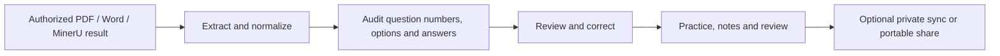

<div align="center">
  
  <h1>AveCove Elapse</h1>
  <p><strong>Turn the material you are allowed to use into a question bank you can actually keep learning from.</strong></p>
  <p>A privacy-first, self-hosted workspace for medical question-bank import, focused practice, review, notes, and optional AI assistance.</p>

  <p>
    <a href="https://allo.avecrouge.top/"><strong>Open the live site</strong></a>
    · <a href="README-zh.md">简体中文</a>
    · <a href="docs/部署与上线指南.md">Deployment</a>
    · <a href="forge/README.md">Elapse Forge</a>
    · <a href="https://avecrouge.top/">Author blog</a>
  </p>

  <p>
    <a href="https://github.com/Sifortonzh/AveCove-Elapse/actions/workflows/ci.yml"></a>
    
    
    
    
    
  </p>
</div>

<p align="center">
  
</p>

> [!IMPORTANT]
> **Current release: v1.4.7.** Medical practice, library management, optional synchronization, and the Western Medicine 306 workflow are the stable core. English Lab remains a preview, and automated OCR/AI extraction must always be reviewed against the source.

## Product map

| Area | What is available | Stage |
| --- | --- | :---: |
| **Question Library** | Multi-bank storage, descriptions, search, groups, custom ordering, featured papers, portable files, and seven-day import links | Stable |
| **Practice** | Standard, Blind Review, and Answer-first Memorization; answer sheet, wrong-answer review, Slash Skip, corrections, notes, and source explanations | Stable |
| **Medical formats** | Single/multiple choice, true/false, and A1/A2/A3/A4/B1/C/X structures with shared stems or option pools | Active focus |
| **Western Medicine 306** | Modern 165-question / 300-point audit, legacy C type, first-attempt scoring, and five-subject practice | Active focus |
| **AI assistance** | Personal or site-wide OpenAI-compatible providers, import structuring, explanations, follow-up, and note writing | Optional |
| **Cross-device sync** | Parsed banks, progress, wrong answers, featured items, notes, settings, groups, and deletion tombstones | Optional |
| **English Lab** | Interactive demos for cloze, reading, listening, matching, translation, and writing | Preview |
| **Elapse Forge** | Isolated scanned-bank workbench with MinerU-result ingestion, normalization, audit, and Elapse export | Foundation 0.2 |

## Why Elapse

- **Your library stays yours.** Structured banks and learning records are local-first; synchronization is optional and self-hostable.
- **Source evidence outranks AI guesses.** Imported answers and explanations remain distinct from AI output, and missing source answers stay visibly pending.
- **Practice survives imperfect imports.** Questions, options, and answers can be corrected while practicing; exports and shares use the corrected version.
- **Built around real medical material.** Cross-page joins, shared-stem groups, end-of-book answer registries, 306 scoring, and chapter metadata are first-class concerns.
- **Designed for the devices used to study.** The interface adapts across phone, iPad, Mac, and PC, with persistent tablet controls and exam-like typography.

## From document to durable practice



### Import and library management

- Import `.doc`, `.docx`, text PDF, scanned PDF, and AveCove portable JSON.
- Add a description with chapter-to-question ranges and group related yearly or subject banks.
- Search titles, descriptions, groups, stems, options, categories, and source numbers.
- Rename, delete, reset only the learning record, feature a paper, or sort by custom order, import time, or name.
- Review wrong questions across every bank in the current group.
- Start unanswered banks in test mode, then attach an answer file and reconcile them later.
- Export the corrected bank as a portable file or create a private random import link that expires after seven days.

### Practice and review

- Sequential practice, 20-question Random Challenge, and 100-question Mock Exam.
- **Standard:** confirm and grade each answer.
- **Blind Review:** keep moving without immediate judgement and check answers when ready.
- **Answer-first Memorization:** reveal the source answer immediately without changing practice statistics.
- Single tap selects or cancels; double tap excludes a distractor.
- Search the whole library while practicing and return to the same question with the selection intact.
- Use the answer sheet, group-wide wrong-answer review, featured questions, tags, Markdown notes, image notes, and per-option annotations.
- Slash one question or a source-number range such as `1-31`; slashed questions show `/` and do not affect accuracy or 306 scoring.
- On iPad, previous and next/confirm actions remain available while long questions scroll.

### Medical structures and Western Medicine 306

- Preserves A1, A2, A3, A4, B1, C, and X identities instead of flattening every question into generic choice items.
- A3/A4 groups keep the shared case stem and linked subquestions together; B1 groups reuse their source option pool.
- Handles end-of-book answer tables and source explanations without merging them into AI-generated analysis.
- The 306 workbench audits expected count, A/B/C/X distribution, source numbers, duplicates, and answer coverage.
- Modern 165-question papers support Physiology, Biochemistry, Pathology, Internal Medicine, or Surgery-only practice.
- First-attempt scoring is immutable: answering correctly on a later attempt does not raise the original exam score.
- Missing items or answers are reported explicitly; the importer does not fill them with medical-knowledge guesses.

### AI and notes

- Configure personal AI in the browser or an administrator-managed site provider on the server.
- Use any compatible provider by setting its base URL, model, and API key.
- Generate a concise summary, common pitfalls, related concepts, or a follow-up answer only when needed.
- Write useful AI output into Markdown notes with the question source and reusable tags.
- Original-file explanations remain visible after submission and coexist with AI output.
- Elapse does not impose an application-level daily quota on personal explanations or follow-up; provider limits and billing still apply.

## Quick start

Requirements: Node.js `22.13+` and npm.

```bash
git clone git@github.com:Sifortonzh/AveCove-Elapse.git
cd AveCove-Elapse
cp .env.example .env
npm ci
npm run dev
```

Open `http://localhost:3000`. Before a release, run:

```bash
npm run lint
npm test
```

`npm test` performs a production build before running the product tests.

## Production deployment with Docker and Caddy

```bash
cp .env.example .env
docker compose up -d --build
curl http://127.0.0.1:3011/api/health
```

The app listens on `127.0.0.1:3011`. Put Caddy, Nginx, or another HTTPS reverse proxy in front of it. The optional bundled Caddy profile can be started with:

```bash
docker compose --profile caddy up -d --build
```

Production releases in this repository build the Docker image on GitHub Actions; the small server only loads the finished image and restarts it. See the [Deployment Guide](docs/部署与上线指南.md) and [Launch Checklist](docs/上线检查清单.md).

<details>
<summary><strong>QQ Mail / Foxmail verification codes</strong></summary>

```env
SMTP_HOST=smtp.qq.com
SMTP_PORT=465
SMTP_SECURE=true
SMTP_USER=your-account@foxmail.com
SMTP_PASS=your-16-character-smtp-authorization-code
SMTP_FROM="AveCove Elapse <your-account@foxmail.com>"
```

Enable SMTP in the mailbox settings and use the generated authorization code, not the web-login password. Recreate the app container after changing `.env`:

```bash
docker compose up -d --force-recreate app
```
</details>

<details>
<summary><strong>Personal and site AI</strong></summary>

- `/custom-ai`: personal provider details stay in the user's browser and do not require administrator approval.
- `/admin/ai`: the deployment administrator manages the optional site provider with `ADMIN_KEY`.

Use independent random secrets:

```env
SYNC_SECRET=replace-with-32-or-more-random-characters
CONFIG_ENCRYPTION_KEY=replace-with-an-independent-random-secret
ADMIN_KEY=replace-with-another-long-random-secret
```
</details>

> [!CAUTION]
> Never commit `.env`, SMTP authorization codes, AI keys, production database URLs, or real student data.

## Storage and privacy boundaries

| Data | Default location |
| --- | --- |
| Imported structured banks | Browser IndexedDB |
| Local answers, notes, and settings | Browser storage |
| Optional synchronized banks and records | Self-hosted PostgreSQL |
| Original Word/PDF/image files | User device; not retained by sync |
| Personal AI key | User browser |
| Site AI key | Server configuration or encrypted database |

The student ID is converted into an irreversible sync identifier; the original value is not stored. Email is optional and is used only for verification-code login or identity protection. Read [Data and Privacy](docs/数据与隐私说明.md), [Security](SECURITY.md), [Terms](TERMS.md), and [Copyright](COPYRIGHT.md) before operating a public instance. These documents contain the project disclaimer and responsible-use terms.

## Elapse Forge

Forge is the isolated import workbench under `/forge`. It can ingest the original file together with an already completed official MinerU Hybrid JSON result and optional Markdown, preserving page references, coordinates, tables, and image evidence without spending OCR again.

Forge is deliberately separate from the stable practice application. Foundation `0.2.0` improves chapter-scoped numbering, split options, cross-page seams, and answer-table association, but it is **not a zero-error OCR product**. Keep the original document for visual review and verify every generated bank before study.

Start with [Forge README](forge/README.md), [architecture](docs/FORGE_ARCHITECTURE.md), [OCR modes](docs/FORGE_OCR.md), and [handoff](docs/FORGE_HANDOFF.md).

## Project status

| Status | Work |
| --- | --- |
| **Available now** | Stable medical practice, multi-bank library, corrections, notes, optional sync, portable sharing, 306 audit/scoring, and Docker deployment |
| **Current priority** | Better deterministic and AI-assisted imports for chapter-based medical workbooks, cross-page questions, and end-of-book answer registries |
| **Next** | Stronger post-import review tools, faster large-document processing, and broader curriculum profiles |
| **Paused preview** | Full English exam import; the existing English Lab interactions remain available for demonstration |

Known limitations:

- OCR quality depends on scan clarity, layout, watermark density, and page continuity.
- Large-file AI structuring can be slow or incomplete; always audit question count and answers.
- English importing is experimental and should not be used for high-stakes answer judgement yet.
- No open-source license is currently declared. Public source access does not grant reuse, redistribution, commercial use, or brand rights.

<details>
<summary><strong>Release history</strong></summary>

- **v1.4.7** — Added resilient deployment startup checks for a busy or recently restarted server.
- **v1.4.6** — Reorganized bilingual project documentation and GitHub presentation.
- **v1.4.5** — Fixed iPad previous-question control during long-page scrolling.
- **v1.4.4** — Added full-book ENT/head-and-neck MinerU conversion support.
- **v1.4.3** — Joined sequential MinerU Hybrid JSON volumes and retained structurally complete objective questions.
- **v1.4.2** — Improved military-medical answer tables and legacy Word imports.
- **v1.4.1** — Moved production builds to GitHub Actions for low-memory servers.
- **v1.4.0** — Added grouped A1/A2/A3/A4/B1/C/X practice and Slash Skip.
- **v1.3.x** — Added import-result ingestion, practice corrections, annotations, iPad controls, exam typography, and learning-panel refinements.
- **Version `1.2.0`–`1.2.4`** — Added Blind Review, Answer-first Memorization, featured papers, 306 subject practice, and conflict-aware library sync.
- **v1.1.x** — Introduced the Spatial Bento dashboard and live note counts.
- **v1.0.x** — Established the public self-hosted release, bilingual docs, branding, and English interaction preview.
</details>

## Documentation

| Topic | Document |
| --- | --- |
| Chinese overview | [README-zh.md](README-zh.md) |
| Feature and video guide | [1.0 Feature and Video Demonstration Outline](docs/1.0.0功能介绍与视频演示提纲.md) |
| Western Medicine 306 | [Import and scoring](docs/西医综合306导入与计分.md) |
| Forge | [Setup](forge/README.md) · [Architecture](docs/FORGE_ARCHITECTURE.md) · [Pipeline](docs/FORGE_PIPELINE.md) |
| Operations | [Deployment](docs/部署与上线指南.md) · [Launch checklist](docs/上线检查清单.md) |
| Governance | [Question sources](QUESTION_SOURCES.md) · [Terms](TERMS.md) · [Copyright](COPYRIGHT.md) · [Security](SECURITY.md) |

## Rights and responsibility

© 2026 AveCove Elapse / 红豆生南国. All relevant rights reserved.

The repository includes only a small demonstration bank. Users are responsible for ensuring that imported, synchronized, or shared material is authorized. Do not upload patient information, confidential exam material, illegally copied publications, or personal secrets. AI and community output must not replace textbooks, current guidelines, professional judgement, or clinical care.
