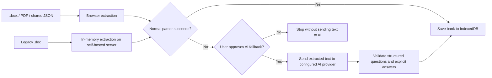
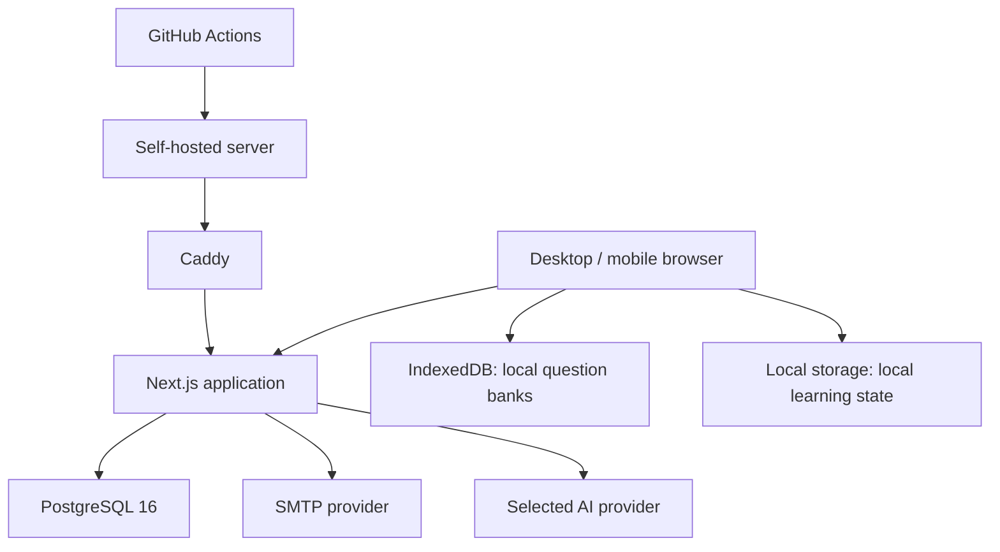

# AveCove Elapse · 红豆生南国

<p align="center">
  
</p>

<p align="center">
  A modern, self-hosted question-bank workspace for deliberate practice, review, and AI-assisted learning.
</p>

<p align="center">
  <a href="README-zh.md">简体中文</a> ·
  <a href="docs/部署与上线指南.md">Deployment Guide (Chinese)</a> ·
  <a href="docs/上线检查清单.md">Launch Checklist</a> ·
  <a href="SECURITY.md">Security</a> ·
  <a href="COPYRIGHT.md">Copyright</a>
</p>

<p align="center">
  
  
  
  
  
</p>

<p align="center">
  
</p>

## Overview

AveCove Elapse is the independent, self-hostable edition of **“红豆生南国”**, a focused learning application originally designed for medical question practice.

It turns personal Word and PDF collections into an organized question-bank workspace with local-first storage, single- and multiple-choice practice, wrong-answer review, notes, optional AI explanations, lightweight cross-device learning-state sync, and a moderated discussion area.

The project deliberately avoids advertising, phone-number login, and mandatory social-platform accounts. A student ID is converted into an irreversible sync identifier; the original value is not stored in the database.

> Current release line: `0.3.x` preview. The built-in bank contains only eight demo questions. Full copyrighted course banks are not bundled.

## Why this project

- **Bring your own material.** Import personal `.doc`, `.docx`, `.pdf`, scanned PDF, or portable `.hongdou.json` banks.
- **Local-first by default.** `.docx` and PDF files are parsed in the browser. Legacy `.doc` files are extracted in self-hosted server memory, with no original-file persistence.
- **A real library, not a one-off importer.** Every imported bank is retained in “My Question Banks” with switching, renaming, search, sharing, deletion, and per-bank learning-record reset.
- **Transparent AI boundaries.** AI is optional. If normal parsing fails, extracted text is sent to the configured provider only after explicit user consent.
- **Medical-learning safeguards.** AI output and community content are framed as learning aids, never as clinical diagnosis or treatment guidance.
- **Self-hosting ready.** PostgreSQL, Docker Compose, Caddy HTTPS, health checks, backup scripts, and GitHub Actions are included.
- **Provider freedom.** Use domestic or international AI services instead of being locked to a single vendor.
- **Privacy-conscious identity.** No phone number or WeChat login is required.

## Feature highlights

### Question-bank library

- Batch import multiple files in one selection or drag-and-drop operation.
- Parse legacy `.doc`, modern `.docx`, text PDF, scanned PDF with browser OCR, and portable Red Bean JSON banks.
- Show per-file waiting, processing, success, AI-ready, failure, and timeout states.
- Preserve every successful import in browser IndexedDB.
- Switch the active bank without deleting learning records from other banks.
- Rename or delete an imported bank.
- Search stems, options, categories, source numbers, and bank names across all local banks, with relevance ranking and highlighted matches.
- Export a portable `.hongdou.json` file after a copyright and privacy confirmation.
- Reset one bank’s answers, wrong-answer state, favorites, and notes through an irreversible-action confirmation UI while preserving the bank itself.

### Practice and review

- Automatically distinguish single-choice and multiple-choice questions from answer data.
- Practice only single-choice questions or include both types.
- Sequential and randomized question order.
- Optional shuffled answer choices.
- Optional auto-advance after a correct answer; wrong answers remain visible for review.
- Unanswered, wrong-answer, and favorite scopes.
- Answer sheet, direct question navigation, current-bank search, favorites, and personal notes.
- Local progress persistence and import/export of learning records.
- Light and dark themes.

### English Learning beta

- A separate **AveCove Elapse · English Lab** workspace that does not change the medical-practice flow.
- CET, postgraduate entrance exam, IELTS, and TOEFL stage switching.
- A browser-local **Test Library** for imported Word, legacy `.doc`, PDF, and image files.
- Automatic stage and section mapping for cloze, reading, paragraph matching, translation, listening resources, and writing.
- Dedicated support for the current postgraduate English I structure: Use of English 1–20, four Reading Part A texts 21–40, Part B paragraph matching 41–45, Translation 46–50, and Writing 51–52.
- Dedicated CET-6 mapping for Writing; Listening Conversations, Passages, and Recordings (1–25); Reading Section A word bank (26–35), Section B long-reading matching (36–45), Section C close reading (46–55); and Chinese-to-English Translation.
- Hybrid PDF extraction keeps trustworthy text-layer pages and runs Chinese-English OCR only on scanned pages, which is especially useful for mixed answer-analysis booklets.
- Imported answer keys and available source explanations stay attached to their questions; missing answers are never guessed.
- Word-bank choices are single-use within a section, and imported responses remain available while moving between questions and sections.
- Cloze, reading, listening-resource, and writing demonstrations remain available without importing a file.
- Click-to-translate reading words with a browser-local wordbook.
- Text selection highlights plus real-time pen, marker, eraser, undo, and clear tools over the passage.
- Answer submission followed by the correct option, passage evidence, and distractor analysis.
- Responsive layouts for desktop, tablet, and iPhone-width screens.

### AI-assisted learning

- “大神总结”: concise key-point summary and option differentiation.
- “易错提示”: trap words, distractors, and recurring mistakes.
- “知微”: patient follow-up explanations with conversational context.
- Optional AI fallback for non-standard answer sheets, including formats such as `1-A`, `1.A`, or a consolidated answer table.
- AI fallback never guesses missing answers by design; it is instructed to keep only questions with explicit source answers.
- Daily request quota and provider-side budget controls.
- API keys remain server-side and may be encrypted in PostgreSQL with AES-256-GCM.

Supported provider presets:

| Region | Providers |
| --- | --- |
| China | DeepSeek, Alibaba Qwen, Kimi, Doubao, Zhipu GLM |
| International | OpenAI, Google Gemini, Anthropic Claude |
| Custom | OpenAI-compatible private gateway or third-party endpoint |

Provider URLs and model identifiers are configurable because vendors may change their model catalogues over time.

### Identity, sync, and community

- Student ID is transformed into an irreversible HMAC-based identifier; the raw student ID is not written to PostgreSQL.
- Optional email verification-code login for account recovery and protected comment identity.
- No phone number or social-platform login.
- Sync-capable progress, favorites, notes, settings, and nickname.
- Learning-record JSON export and import.
- Shared comments with likes, reports, personal deletion, sensitive-word pre-review, muting, and an admin moderation console.
- Account deletion removes associated cloud learning data and community records while retaining browser-local data.

Question-bank contents remain browser-local by design. Cross-device learning state does not upload original Word or PDF files; users must separately place the corresponding bank on each device.

## Import flow and privacy boundary



The original document is never sent to the AI provider. Only extracted text is submitted, and only after the user confirms that the file contains no patient data or other sensitive information. AI recognition can be wrong; imported answers should be sampled and verified.

## Architecture



| Layer | Technology | Responsibility |
| --- | --- | --- |
| Web application | Next.js 16, React 19, TypeScript | UI, practice flows, API routes |
| Local data | IndexedDB and localStorage | Imported banks and offline-first learning state |
| Server data | PostgreSQL 16 | Anonymous identities, sync state, comments, moderation, AI settings and usage |
| Document parsing | Mammoth, PDF.js, Tesseract.js | Word extraction, PDF text extraction, browser OCR |
| Email | Nodemailer + your SMTP provider | Login verification codes |
| Reverse proxy | Caddy | HTTPS certificates and public routing |
| Operations | Docker Compose, shell scripts, GitHub Actions | Deployment, health checks, backups, restore, CI/CD |

## Repository layout

```text
app/
├── api/                 Server routes for auth, sync, comments, AI, health
├── admin/               Comment and AI administration
├── custom-ai/           User-facing provider configuration page
├── lib/                 Import, parser, local-bank, auth and provider logic
├── page.tsx             Main product experience
└── questions.json       Eight-question demo bank
db/init.sql              PostgreSQL schema
docs/                    Deployment, launch and privacy documentation
scripts/                 Migration, backup, restore and maintenance scripts
.github/workflows/       CI and server deployment workflows
Dockerfile               Production application image
docker-compose.yml       Application, PostgreSQL and Caddy stack
Caddyfile                 HTTPS reverse-proxy configuration
```

## Requirements

### Local development

- Node.js `>= 22.13`
- npm
- PostgreSQL 16 for server-backed sync, email-code login, comments, and saved AI configuration

The local question-bank and basic practice experience can still run when optional external services are unavailable.

### Production

- Linux server, recommended Ubuntu 22.04 or 24.04
- 2 CPU cores, 4 GB RAM, and at least 20 GB disk as a practical starting point
- Docker Engine and Docker Compose v2
- A domain with DNS records pointing to the server
- Ports 80 and 443 open to the public; PostgreSQL should not be exposed publicly

## Quick start

```bash
git clone <your-repository-url>
cd AveCove-Elapse
cp .env.example .env
npm install
docker compose up -d postgres
npm run dev
```

Open `http://localhost:3000`.

- AI provider configuration: `http://localhost:3000/custom-ai`
- Comment moderation: `http://localhost:3000/admin`
- Health endpoint: `http://localhost:3000/api/health`

In development, an unconfigured SMTP service returns a debug verification code instead of sending email. Never rely on that behavior in production.

## Environment configuration

Copy `.env.example` to `.env`. Never commit `.env`, SMTP passwords, AI keys, deployment SSH keys, or generated backups.

### Required application secrets

Generate separate strong values; do not reuse one secret for multiple fields.

```bash
openssl rand -base64 36
```

| Variable | Purpose |
| --- | --- |
| `POSTGRES_PASSWORD` | PostgreSQL application password |
| `SYNC_SECRET` | HMAC secret used to derive irreversible sync IDs |
| `CONFIG_ENCRYPTION_KEY` | Encrypts stored AI API keys |
| `ADMIN_KEY` | Protects moderation and AI administration routes |
| `DOMAIN` | Public hostname used by Caddy |
| `NEXT_PUBLIC_SITE_URL` | Full public HTTPS URL |

### SMTP for a domain mailbox

```dotenv
SMTP_HOST=smtp.example.com
SMTP_PORT=465
SMTP_SECURE=true
SMTP_USER=no-reply@example.com
SMTP_PASS=replace-with-smtp-password-or-app-password
SMTP_FROM=红豆生南国 <no-reply@example.com>
```

- Port `465` normally uses `SMTP_SECURE=true`.
- Port `587` with STARTTLS normally uses `SMTP_SECURE=false`.
- Use the SMTP password or application-specific password issued by your mailbox provider, not necessarily the webmail password.
- After changing `.env`, recreate the application container and send a real verification code. Check the spam folder during validation.

### AI configuration

- `/custom-ai` is self-service: users can supply their own DeepSeek, Qwen, Kimi, Doubao, GLM, OpenAI, Gemini, or Claude key without administrator approval. The configuration stays in that browser and is relayed over HTTPS only when a request is made; it is not written to the site database.
- `/admin/ai` is for the site-wide provider. Administrators authenticate with `ADMIN_KEY`; the public provider key is encrypted before being stored in `app_settings`. `OPENAI_API_KEY` and `OPENAI_MODEL` remain optional OpenAI fallbacks.

Personal configuration takes precedence over the public provider. To prevent SSRF, self-service users can select only the official endpoints of preset providers; custom compatible gateways remain an administrator setting.

Set `AI_DAILY_LIMIT` to control requests per anonymous visitor or sync identity, and configure billing alerts in the provider console.

## Production deployment with Docker and Caddy

1. Point the domain’s A/AAAA records to the server.
2. Clone the repository into a dedicated directory such as `/opt/avecove-elapse`.
3. Create `.env` from `.env.example` and replace every placeholder.
4. Keep PostgreSQL private; expose only SSH, HTTP, and HTTPS as required.
5. Start the stack:

```bash
docker compose up -d --build
docker compose ps
```

6. Verify `https://your-domain.example/api/health`.
7. Complete the [launch checklist](docs/上线检查清单.md) before inviting users.

Caddy obtains and renews HTTPS certificates automatically when DNS and firewall settings are correct.

For the complete server procedure, backup policy, and rollback instructions, read [docs/部署与上线指南.md](docs/部署与上线指南.md).

## GitHub Actions deployment

The repository includes:

- `.github/workflows/ci.yml` for automated checks.
- `.github/workflows/deploy.yml` for updating a self-hosted server from `main`.

Configure these repository secrets before enabling deployment:

| Secret | Description |
| --- | --- |
| `DEPLOY_SSH_KEY` | Dedicated private key used only for deployment |
| `SERVER_HOST` | Server IP address or hostname |
| `SERVER_USER` | Restricted deployment user |
| `SERVER_PATH` | Deployment directory, for example `/opt/avecove-elapse` |

The server’s `.env` and backup directory should remain on the server and must not be overwritten by source deployment.

## Database, backup, and recovery

Run schema migrations when required:

```bash
npm run db:migrate
```

Create a manual PostgreSQL backup:

```bash
./scripts/backup.sh
```

Restore only during a controlled maintenance window:

```bash
./scripts/restore.sh /absolute/path/to/avecove-elapse-date.sql.gz
```

The maintenance installer can configure recurring backups and log rotation:

```bash
sudo ./scripts/install-server-maintenance.sh /opt/avecove-elapse
```

Backups are useful only when restoration is tested periodically.

## Validation

```bash
npm run lint
npm test
```

`npm test` performs a production build and runs product-level checks covering the demo bank, core user flows, multi-bank storage, batch import, AI fallback, moderation, security-related copy, and deployment materials.

## Security and privacy notes

- Do not import patient names, hospital identifiers, contact details, raw imaging, or other clinical data.
- Do not put secrets in browser-side code, Git history, screenshots, issues, or chat messages.
- Session cookies use `HttpOnly`, `SameSite=Lax`, and HTTPS-only delivery in production.
- Email codes expire after ten minutes and are rate-limited.
- Comments are rate-limited and support sensitive-word review, reports, hiding, muting, and admin audit records.
- PostgreSQL must stay behind the application network and must not expose port 5432 publicly.
- Report security issues without attaching real student IDs, email addresses, keys, or copyrighted question-bank files.

See [SECURITY.md](SECURITY.md) and [docs/数据与隐私说明.md](docs/数据与隐私说明.md).

## Copyright and responsible use

The product name, interface, snake-and-red-bean emblem, and related visual assets are reserved by the project.

Imported Word, PDF, shared JSON, course, and textbook content remains the property of the respective rights holders. Users are responsible for confirming that they have permission to study, organize, or share the material. The share flow intentionally displays a copyright and privacy warning.

Question answers, AI output, and public discussion are for learning support only. They do not replace current textbooks, guidelines, professional judgment, diagnosis, or treatment advice.

This repository does not currently declare an open-source license. Read [COPYRIGHT.md](COPYRIGHT.md), the [disclaimer and responsible-use terms](TERMS.md), and [QUESTION_SOURCES.md](QUESTION_SOURCES.md) before redistribution or public question-bank publication.

## Roadmap

- Broader CET-4, IELTS, TOEFL, and publisher-specific exam-layout coverage, plus an editable import-review screen.
- QR/audio extraction and source-file attachment review for listening papers.
- AI-assisted vocabulary completion, sentence translation, and writing feedback.
- Bank-aware cross-device identity and conflict handling.
- Stronger import review, answer auditing, and duplicate detection.
- Optional spaced-repetition scheduling and learning analytics.

Roadmap items are plans, not guarantees. English imports are currently stored in the browser-local Test Library; review the detected sections and answers before high-stakes use.

## Documentation

- [Chinese README / 中文说明](README-zh.md)
- [Deployment and launch guide / 部署与上线指南](docs/部署与上线指南.md)
- [Launch checklist / 上线检查清单](docs/上线检查清单.md)
- [Data and privacy / 数据与隐私说明](docs/数据与隐私说明.md)
- [Security notes](SECURITY.md)
- [Copyright and use](COPYRIGHT.md)
- [Disclaimer and responsible-use terms](TERMS.md)
- [Question-source register](QUESTION_SOURCES.md)

---

Built for focused study, careful review, and ownership of one’s own learning materials.
